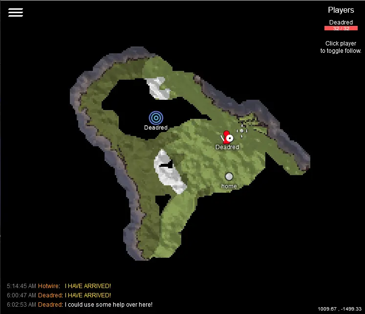

# Valheim WebMap

This server side mod creates a web based map that shows live players and allows shared exploration. After port forwarding the correct port, you can share `http://your_ip:port` to anyone else and they can see the map too. **Clients do not need to have any mods installed!**

For players to show up on the map, they must set **visible to other players** in the in-game map screen. Press `m` to bring up the map settings.

Currently only works with Valheim dedicated server.

## Features

* A explorable map of your Valheim world in your browser that you can zoom with the mousewheel or pinch zoom on mobile.
* Players can place their own pins with chat commands (see below for more info)
* Map pings from in game players will show up on the web map as well.
* Connected players list.
* Auto follow player feature.
* Connect and chat messages.
* Discord server status and player join/leave notifications.

## Installation

1. Assuming you have [BepInEx] installed and working, place the WebMap directory in:

       Steam\steamapps\common\Valheim dedicated server\BepInEx\plugins\WebMap

2. After starting the server for the first time a default configuration file will be created in:

       Steam\steamapps\common\Valheim dedicated server\BepInEx\config

3. Stop the server, edit the configuration, start the server. Always stop the server
   before making configuration changes, _otherwise they will be lost on shutdown_.

## Updating

If you are updating, one additional thing you and anyone else using the web map might need to do is __clear your browser cache__.

You may also be able to hold down the `shift` key and click the reload button in your browser.

## Chat Commands

This mod supports placing pins with chat commands. Press `Enter` to start chatting in game. The commands are as follows:

* `!pin` - Place a "dot" pin with no text on the map where you are currently standing.
* `!pin my pin name` - Place a "dot" pin with "my pin name" under it on the map where you are currently standing.
* `!pin [pin-type] [text]` - Place a pin of a certain type with optional text under it on the map where you are currently standing.
    * Pin types are: `dot`, `fire`, `mine`, `house` and `cave`. Example command: `/pin house my awesome base`
* `!undoPin` - Delete your most recent pin.
* `!deletePin [text]` - Delete the most recent pin that matches the text exactly.

If a player creates too many pins, their oldest pin will be removed. There is a setting to control how many pins a player can create.

_Commands are not case sensitive._

## Licence

Where applicable, assume stuff is under the MIT licence.

## Credit

* Currently maintained by [Jeff Clark](https://github.com/h0tw1r3)
* Original work by [Kyle Paulsen](https://github.com/kylepaulsen)
* Background by [webtreats], released under the [CC BY 2.0] license.

[BepInEx]: https://github.com/BepInEx/BepInEx
[node]: https://nodejs.org/en/download/
[webtreats]: https://www.flickr.com/photos/webtreatsetc/4081217254
[CC BY 2.0]: https://creativecommons.org/licenses/by/2.0/
